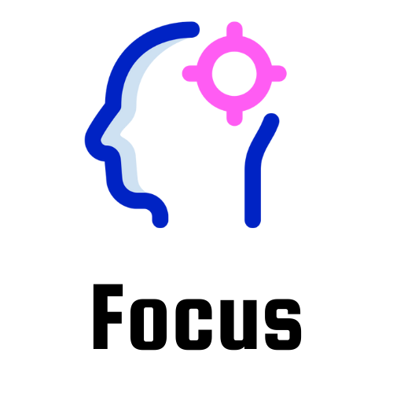

## Focus

Focus is a simple web app which contains the todos for a certain user and a [pomodoro](https://en.wikipedia.org/wiki/Pomodoro_Technique) clock.

#### A little background

I've always struggled to stay focus on one thing for a certain period of time and we all know it's bad for us. Sometimes I stick to one task the whole day. So, I specifically designed this app to fit my needs and I thought it'd also help others who are struggling trying to stay focus.

#### Usage

It is a very simple web app which contains user info and auth for each users, todo manager and a timer to check how long to study, take a short break or long one. 

#### Milestone

- [x] Todo management 
- [x] Timer with breaks and study time
- [ ] Rewards for each achievement
- [ ] Todo history

#### Contribution

Contribution of any kind is welcome! :)

#### Licence 

Check [licence.md](./licence.md)

